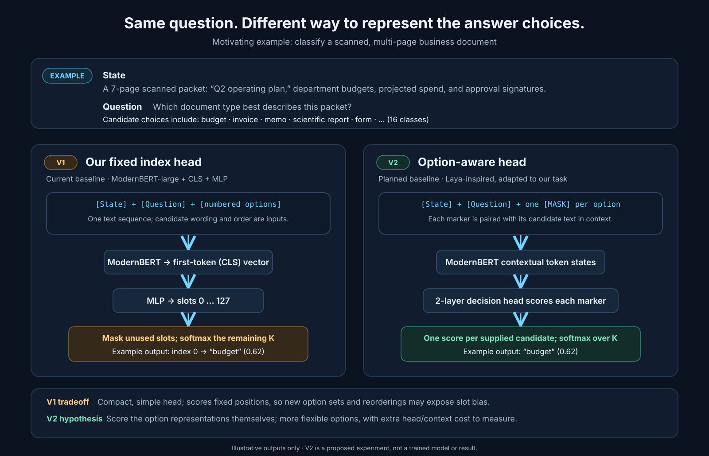

# Selective prediction with compact indexed decision models

*Working manuscript — baseline methods, initial CE results, and prospective experimental protocol. September 23, 2026.*

## Abstract

Decision models map evidence and task-specific alternatives to a bounded probability distribution. Their usefulness in partially automated workflows depends both on predictive accuracy and on whether confidence identifies decisions that should be deferred. We propose a controlled study of a compact encoder trained with cross-entropy and a continuation objective motivated by area under the risk–coverage curve (AURC). Our baseline combines ModernBERT-large with a single masked index-classification head and uses the published Kev decision-v7 training records and predefined partitions. Matched continuation experiments will isolate the training objective while evaluating calibration and selective prediction separately. This draft specifies the baseline, data preparation and evaluation protocol; it does not report evidence of improved utility.

## 1. Motivation and research question

Probability calibration and selective prediction answer different questions. Calibration concerns agreement between predicted probabilities and observed outcomes, whereas selective prediction concerns the errors among examples retained by a confidence-based acceptance rule. Lower expected calibration error (ECE) alone need not produce a better ordering of correct and incorrect decisions.

Our primary question is whether an AURC-motivated training objective increases achievable coverage at low empirical risk relative to an otherwise matched cross-entropy continuation. A secondary question is whether thresholds selected on source-distribution calibration data remain useful on held-out domains. Neither improved calibration nor reliable transfer is assumed in advance.

## 2. Task and model

An example consists of a state s, question q, ordered candidate descriptions o_0 through o_(K−1), and a target index y. We serialize the state, question and numbered candidates into one text sequence. Boolean decisions use the ordered alternatives false and true; ordinal decisions use ordered rubric levels. All three primitives share the same output head. The returned index identifies a candidate in the current request, not a global semantic class.

The encoder is [ModernBERT-large](https://huggingface.co/answerdotai/ModernBERT-large), revision `45bb4654a4d5aaff24dd11d4781fa46d39bf8c13`. Its first-token representation h is passed through a two-layer MLP, z = W₂ GELU(W₁h + b₁) + b₂, with hidden width 128 and 128 output slots. Logits for slots outside the example's K candidates are masked before softmax. The prediction is argmax p, and initial selective confidence is max p. Full distributions and logits are retained for subsequent analysis.

All encoder and head parameters are fine-tuned. This architecture differs from candidate-pointer or independent option-scoring systems. In particular, the fixed slot head does not enforce option-permutation equivariance. We preserve upstream option order in the first experiment; option-order robustness is not an established property of this baseline.

The planned V2 comparison replaces fixed slots with candidate-specific marker scoring, following Laya's published design at a high level. The diagram below uses a multi-class document task to show the representation difference; V2 has not been implemented or evaluated, and the outputs shown are illustrative.

Kev remains the controlled architecture-comparison anchor. Later external datasets, including the 16-class RVL-CDIP-N_MultiPage test set, will be reported as separate suites with their own modality and split caveats rather than merged into Kev's aggregate.

Complete serialized inputs are limited to 2,048 tokens. Oversized sequences or candidate sets are rejected rather than silently truncated. The configured length is an experimental budget, not a claim about the encoder's maximum supported context.

## 3. Data and provenance

We use [Kev's decision-v7 reproduction suite](https://github.com/jaredpalmer/kev/blob/90990a5fac2995b9faa3190f7d437e84f2067768/evals/v7/decision-v7/manifest.json), obtained through its [pinned Hugging Face mirror](https://huggingface.co/datasets/jaredpalmer/kev-suites/tree/a88f56db5341397299137cb68775c2ea6e3f68cb/v7/decision-v7). These are Kev's published reproduction data, not TypeSafe's original Jev training mixture.

The training partition combines 10,000 records from ten public sources—Banking77, BoolQ, AG News, MNLI, SST-5, Yelp, TREC, DBpedia, Amazon reviews and IMDb—with 896 policy records and 1,680 compositional records. Our adapter expands multi-question records into individual training examples while retaining their source/group identifiers, original labels, candidate order and partition membership. We introduce no additional synthetic data or rebalancing.

| Partition | Source records | Decision examples | Role in our protocol |
|---|---:|---:|---|
| Training | 12,576 | 15,576 | Parameter updates |
| Development | 1,204 | 1,468 | Model/protocol selection |
| Calibration | 968 | 1,148 | Temperature and acceptance-threshold fitting |
| Test | 1,176 | 1,440 | Final frozen evaluation |

Training, development and calibration downloads have passed manifest hash/count checks and adapter validation. Their maximum serialized ModernBERT lengths are 1,140, 1,124 and 1,078 tokens respectively. These are preparation measurements, not model results. Test counts are taken from the upstream manifest; test examples have not been downloaded for this experiment.

No duplicate question IDs, shared group IDs or identical canonical state text were found across the three prepared partitions. These checks do not establish semantic or pretraining decontamination. Upstream also does not certify absence of overlap between inherited legacy test examples and newer synthetic controls. The in-domain partitions should not be described as having identical mixture proportions.

## 4. Training protocol

The initial baseline minimizes mean cross-entropy, L_CE = −mean(log p_y). The run used one epoch, seed 17, batch size 4, gradient accumulation 1, learning rate 2×10⁻⁵, weight decay 0.01, gradient checkpointing, and full float32 precision. Training completed 3,894 AdamW updates on 15,576 decision examples. This single-seed run is an initial baseline, not a tuned result.

The planned causal comparison uses two fresh-optimizer continuations from the same CE checkpoint, with matched data order, seed and update budget. One retains CE; the other uses the independently implemented harmonic rank-weighted CE surrogate motivated by [AsymptoticAURC](https://github.com/han678/AsymptoticAURC), with blend coefficient 0.5. Confidence ranks are detached from differentiation and computed within actual microbatches; gradient accumulation does not enlarge the ranking set. The AURC continuation has now completed, but the matched CE continuation has not. Its results are therefore preliminary and do not isolate the objective effect; see the [corrected AURC run report](../docs/results/aurc-20260923-115913.md).

Our baseline is a controlled ModernBERT experiment on Kev records, not an exact reproduction of Kev's architecture, augmentation or two-epoch LoRA recipe. Current Kev releases can also include a later training stage; its pre-delta revision is the closer external data comparison. See the [Kev summary](../docs/kev-baseline-summary.md).

## 5. Evaluation and interpretation

For each continuation, report raw and temperature-scaled predictions. Temperature fitting uses calibration data only. Candidate acceptance thresholds are selected there and applied unchanged to test. Report full-coverage accuracy, NLL, Brier score, ECE with binning details, AURC, risk–coverage curves and achieved coverage/risk at the frozen thresholds. Ordinal error is reported by source and scale. Report per-type/source results alongside pooled results because candidate count and mixture composition affect confidence and aggregate scores.

For an acceptance rule A_t = {i : confidence_i ≥ t}, coverage is |A_t|/N and empirical risk is the fraction of incorrect predictions in A_t. Empty acceptance sets have undefined risk and must be identified explicitly. The retrospective best test-set frontier is a separate oracle diagnostic; thresholds selected using test labels are not deployment results or evidence of a population risk guarantee.

Lower AURC may reflect better ordinary accuracy as well as improved confidence ranking. We therefore interpret curves jointly with full-coverage error and accuracy. Source-calibrated evaluation on entirely held-out task/domain families is a later stage; Kev transfer suites are candidates, but their adapters and metric parity are not yet verified locally. This experiment is also distinct from a full Decision Index submission.

The initial pilot uses one seed and point estimates. Publication-level conclusions require appropriate group-aware uncertainty estimates and justified repeat runs. Confidence-tie handling and aggregation conventions must be reconciled before comparing against external AURC numbers. Further threshold implementation changes await review of the user's existing evaluation code.

## 6. Initial CE baseline results

The completed run `ce-20260923-080034` is the first trained baseline. Table values are pooled per-question metrics on the named partitions; the calibration partition is not temperature-scaled. Brier is the sum across classes, averaged over rows. AURC is the trainer's discrete mean error risk across coverages, with exact confidence ties averaged over within-tie permutations. Ordinal MAE is the error in expected zero-based rubric-level index.

| Partition | N | Accuracy | NLL | Brier | AURC | Ordinal MAE (n) |
|---|---:|---:|---:|---:|---:|---:|
| Development | 1,468 | 62.74% | 1.2965 | 0.5231 | 0.2075 | 0.6375 (240) |
| Calibration | 1,148 | 68.38% | 0.7559 | 0.4008 | 0.1397 | 0.5725 (244) |

Development accuracy by task primitive was 82.20% for boolean (n=472), 55.16% for categorical (n=756), and 48.33% for ordinal (n=240). Banking77 was the weakest large source slice at 21.55% (n=116); this is a development diagnostic, not a tuned or held-out test result. ECE was not emitted in this run. The calibration partition has not yet been used to fit a temperature or acceptance threshold, and test data remains untouched.

Training and both evaluations ran on an NVIDIA A100 SXM4 80GB in float32 and took 1,596 seconds (26.6 minutes). The Modal workspace billing summary increased by $1.08 to $2.02 metered, fully offset by credits; this is a workspace-level change, not an independently attributed per-run invoice. The final checkpoint and prediction artifacts are retained in the Modal Volume. Full metrics and operational details are in the [run report](../docs/results/ce-20260923-080034.md), [status artifact](../docs/results/ce-20260923-080034-status.json), and [training metadata](../docs/results/ce-20260923-080034-training.json).

These results establish that the training and evaluation path completed. They do not show an AURC-training benefit, a calibrated model, or performance on the frozen Jev Decision Index. The primary matched CE versus CE+AURC continuation comparison remains pending; both arms must start from the same CE checkpoint and use the same update budget. Test data is reserved for final frozen evaluation.

One CE+AURC continuation later completed from the CE checkpoint. Its first evaluation accidentally loaded the CE parent; a corrected development/calibration-only pass evaluated the trained continuation. The corrected metrics are reported separately and remain an unpaired comparison against the CE warm-up. A fresh-optimizer matched CE continuation is still required before drawing an objective-level conclusion. No Kev test data was accessed.

## 7. Reproducibility status

The completed run retains code/data/model revisions, resolved configuration, checkpoint lineage, split provenance, prediction artifacts and metric definitions. Failed and negative runs remain in the run ledger. See the [experiment register](../docs/experiment-register.md), [data preparation](../docs/kev-baseline.md) and [Modal guide](../docs/modal-first-baseline.md) for operational details.

If selective utility improves without an unacceptable accuracy tradeoff, proceed to frozen-threshold transfer. If only calibration improves, report that narrower finding. If no useful gain is observed, inspect data semantics and ranking-batch limitations before increasing compute. Multilingual distillation, RL-based calibrated decisions, vision and external Decision 1.0 comparisons remain separate follow-up experiments.

## Appendix A. Illustrative development predictions

The following rows are sampled examples from the development predictions for `ce-20260923-080034`; they were not used to choose model settings or thresholds. The categorical probabilities are from the model's full 77-option distribution for Banking77. Confidence is the probability assigned to the selected option. These cases illustrate behavior and are not a separate evaluation.

| Source / task | Input | Gold choice | Model choice | Confidence |
|---|---|---|---|---:|
| Banking77 · categorical | “Does delivery to the US take long?” | `card_delivery_estimate` | `balance_not_updated_after_bank_transfer` | 0.329 |
| Banking77 · categorical | “Where can I see the refund in my account” | `Refund_not_showing_up` | `request_refund` | 0.300 |
| Banking77 · categorical | “I would appreciate it if I could get an item refunded” | `request_refund` | `request_refund` | 0.550 |
| Yelp · ordinal | “Don’t come here before 10 pm … it was a disaster … The service was also pretty bad …” | 2 stars · poor | 1 star · terrible experience | 0.958 |
| Yelp · ordinal | “If I could give them 0 stars I would … What a horrible experience.” | 1 star · terrible experience | 1 star · terrible experience | 0.959 |

The two Banking77 errors show neighboring intents that differ by the requested outcome: card delivery timing versus transfer balance, and locating an existing refund versus requesting one. The Yelp example is a confident one-level ordinal error. Such high-confidence mistakes matter for selective prediction: confidence is useful only if it tends to rank errors below correct decisions. The short excerpts are lightly shortened for readability; full model inputs are preserved in the prepared development partition. Source question IDs are `banking77/test/290/intent`, `banking77/test/1778/intent`, `banking77/test/1703/intent`, `yelp/test/8206/rating`, and `yelp/test/3835/rating` respectively. Here `test` is the source dataset's original split recorded in provenance; every listed example belongs to Kev's **development** partition, and no Kev test predictions are shown.
